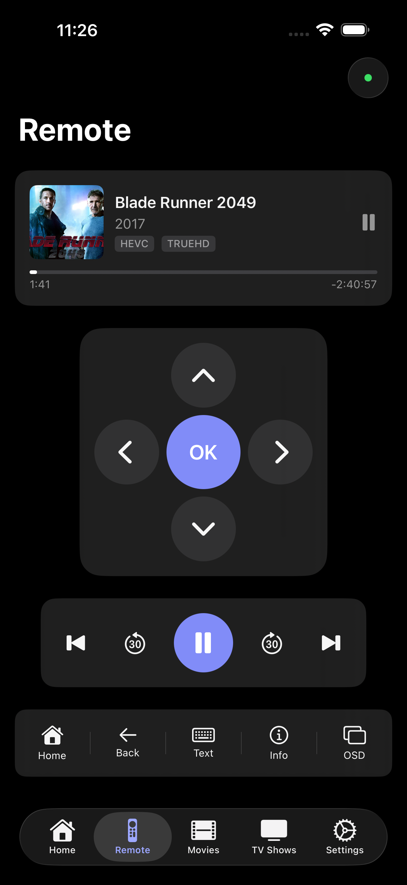
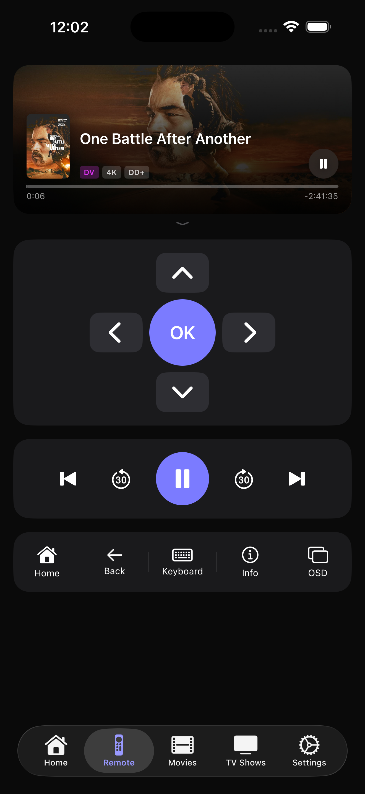
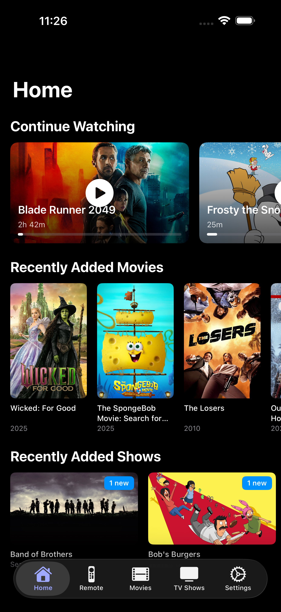
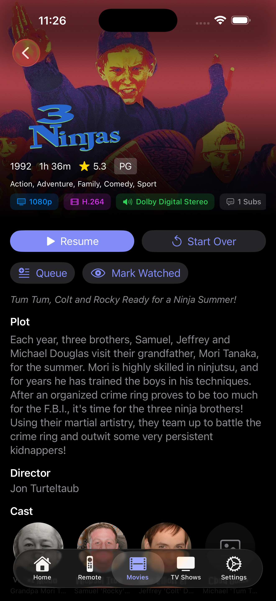
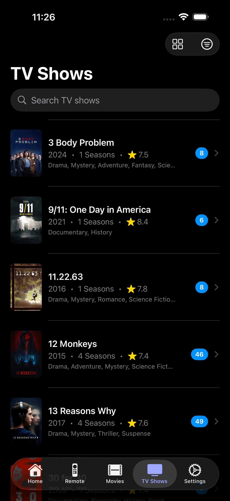
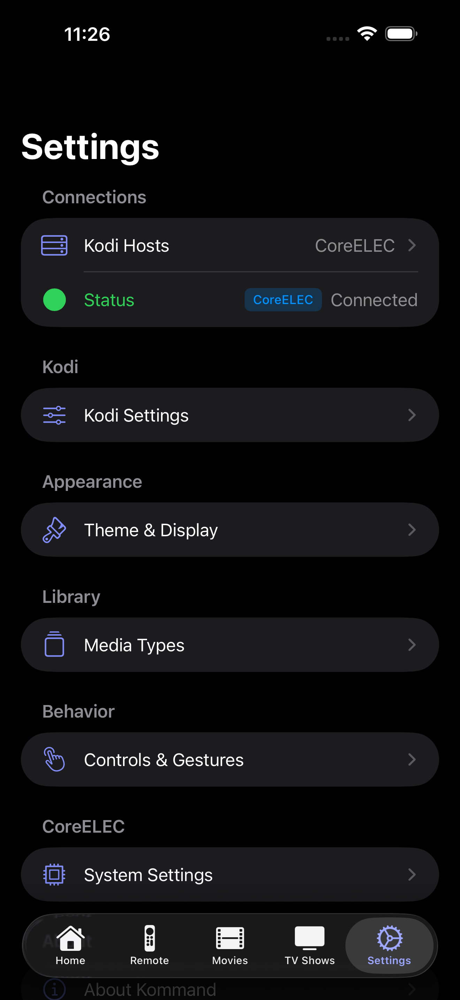

# Kommand

A native iOS remote control app for [Kodi](https://kodi.tv) media center.

## Download

**[Join the TestFlight Beta](https://testflight.apple.com/join/ZXRz9Se1)** to get early access.

## Screenshots

  
  
  
  
  
  

## Features

- **Remote Control** - Full directional pad, playback controls, and volume
- **Now Playing** - Real-time display of current media with artwork
- **Movie Library** - Browse, search, and play your movie collection
- **TV Shows** - Navigate shows by season and episode
- **Music** - Browse artists, albums, and songs
- **Live TV (PVR)** - Access channels, recordings, and timers
- **Dashboard** - Continue watching and recently added content
- **CoreELEC Support** - Enhanced features for CoreELEC devices

## Requirements

- iOS 17.0+
- Kodi with JSON-RPC enabled (Settings → Services → Control)

## Installation

1. Clone the repository
2. Open `kodi.remote.xbmc.xcodeproj` in Xcode
3. Build and run on your device or simulator

## Configuration

1. Enable remote control in Kodi:
   - Go to Settings → Services → Control
   - Enable "Allow remote control via HTTP"
   - Note the port (default: 8080)

2. Add your Kodi host in the app:
   - Enter the IP address and port
   - Optionally set username/password if configured

## Contributing

Contributions are welcome! Please feel free to submit a Pull Request.

## License

This project is licensed under the MIT License - see the [LICENSE](LICENSE) file for details.

## Acknowledgments

- [Kodi](https://kodi.tv) - The amazing open source media center
- Built with SwiftUI and Swift Concurrency
