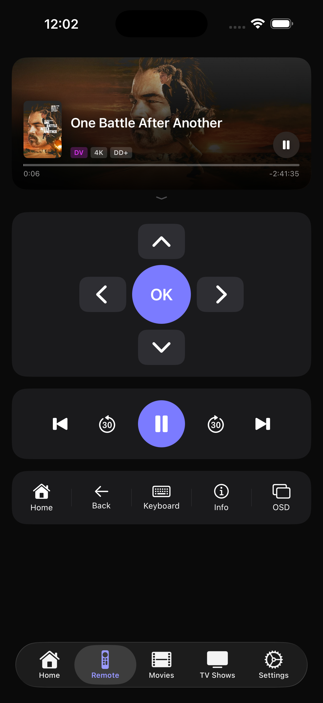
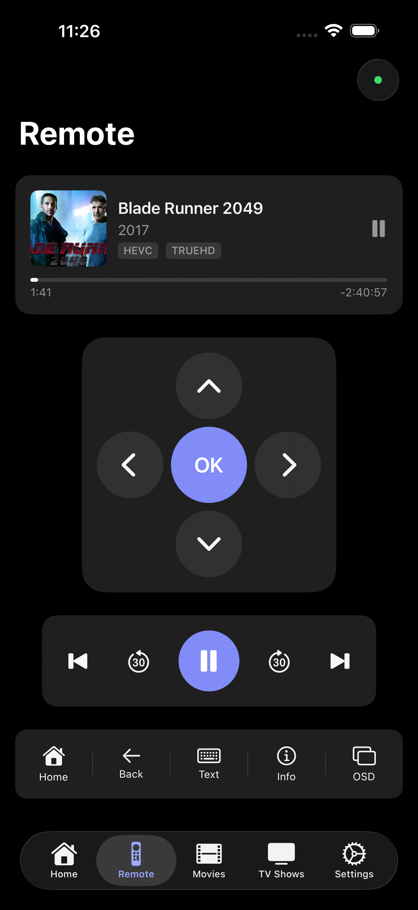
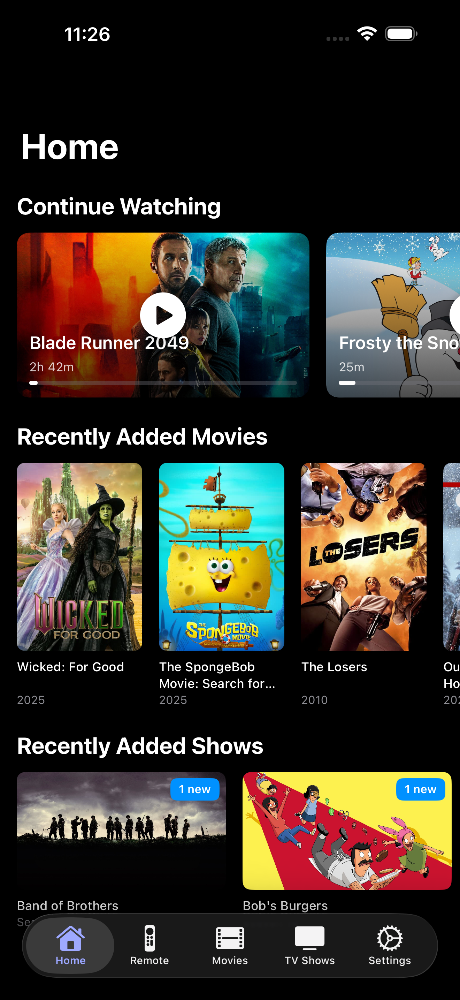
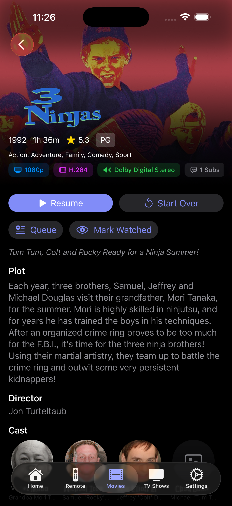
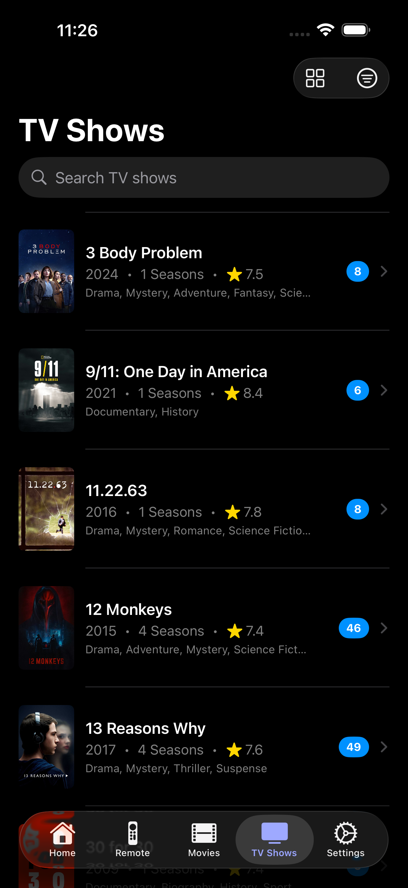
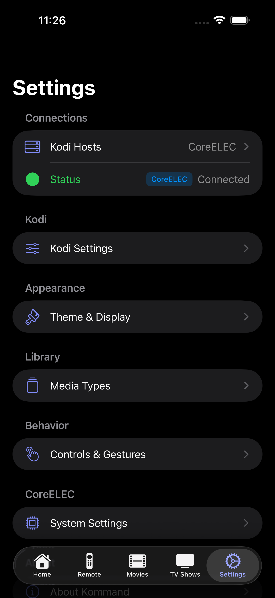

# Kommand

A native iOS remote control app for [Kodi](https://kodi.tv) media center.

## Download

Available on the app store for $2.99 ( hopefully help to cover a portion of my Apple Developer License).

Test flight will remain free.

**[Join the TestFlight Beta](https://testflight.apple.com/join/ZXRz9Se1)**

## Screenshots

  
  
  
  
  
  

## Features

### Remote & Playback
- **Remote Control** — Full directional pad, playback controls, and volume with haptic feedback
- **Now Playing** — Real-time display of current media with artwork via WebSocket
- **Interactive Seek** — Seek bars with real-time progress estimation
- **Live Activity** — Control playback from Lock Screen and Dynamic Island

### Library
- **Movies** — Browse, search, and play your movie collection
- **TV Shows** — Navigate shows by season and episode
- **Music** — Browse artists, albums, and songs with artist detail views
- **Live TV (PVR)** — Access channels, EPG, recordings, and timers
- **Dashboard** — Continue watching, recently added content, and global search
- **Genre Filtering** — Filter libraries by genre with persistent sort/filter preferences
- **Disk Caching** — Library data cached to disk for instant loading
- **Skeleton Loading** — Smooth loading states while content loads

### Platform
- **iPad Support** — Sidebar navigation, flexible layouts, and hero artwork
- **Themes** — Multiple color themes including OLED-optimized options
- **DV Info** — Detailed Dolby Vision profile information (P5, P7, P8.1, etc.)
- **Configurable Power** — Power/sleep controls for any Kodi device

## Technical Details

- **Swift 6** with strict concurrency
- **SwiftUI** + `@Observable` macro — no Combine, no UIKit
- **Zero external dependencies** — pure SwiftUI + Foundation
- **Actor-based networking** — JSON-RPC over HTTP with WebSocket notifications
- **Request throttling** — concurrent Kodi request limiting for stability

## Requirements

- iOS/iPadOS 17.0+
- Kodi with JSON-RPC enabled (Settings → Services → Control)

## Installation

1. Clone the repository
2. Open `kodi.remote.xbmc.xcodeproj` in Xcode
3. Build and run — no package resolution, no pods, no SPM

## Configuration

1. Enable remote control in Kodi:
   - Go to Settings → Services → Control
   - Enable "Allow remote control via HTTP"
   - Note the port (default: 8080)

2. Add your Kodi host in the app:
   - Enter the IP address and port
   - Optionally set username/password if configured

## Contributing

Contributions are welcome! Please feel free to submit a Pull Request.

## License

This project is licensed under the GNU GPLv3 License - see the [LICENSE](LICENSE) file for details.

## Acknowledgments

- [Kodi](https://kodi.tv) — The amazing open source media center
